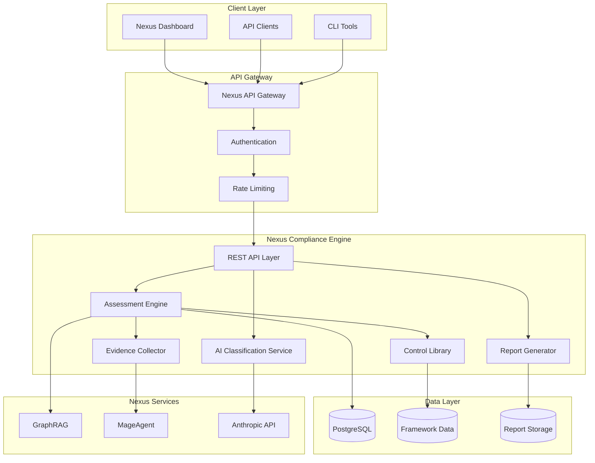
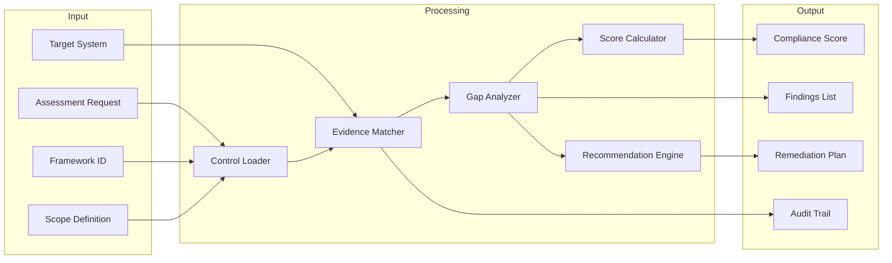
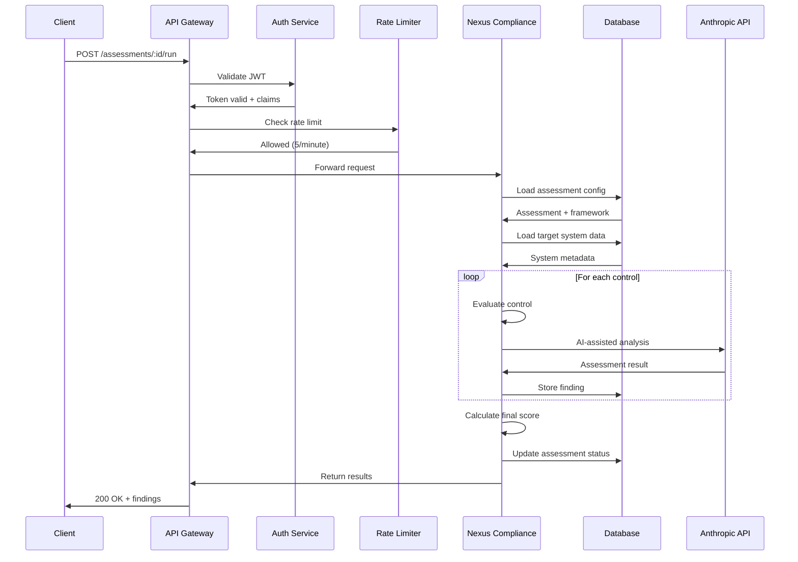
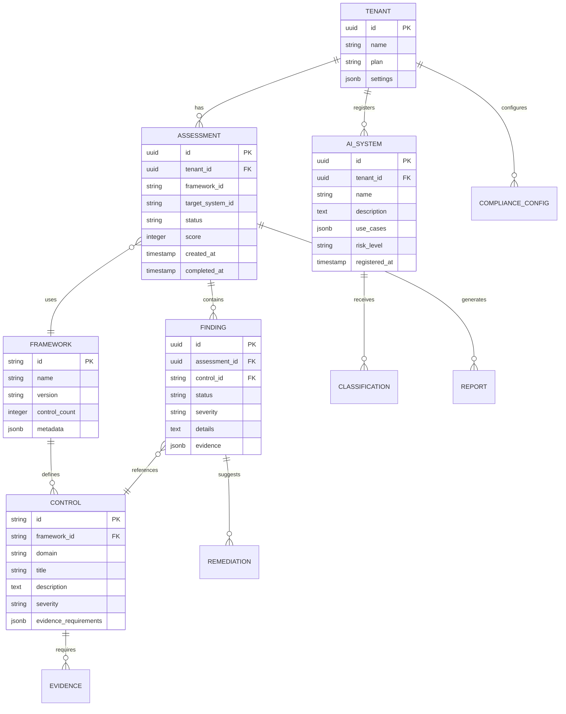
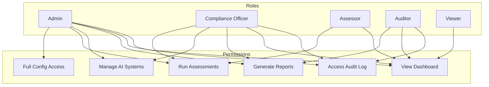
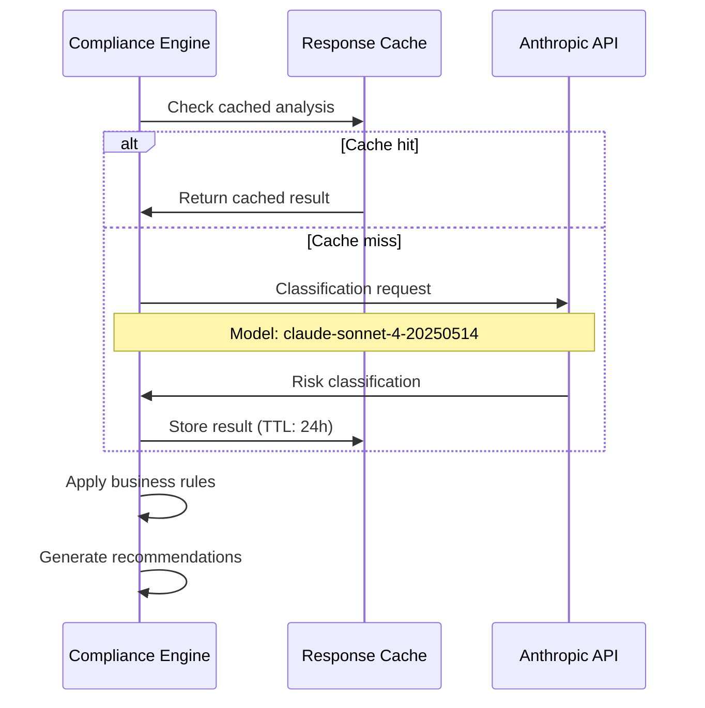
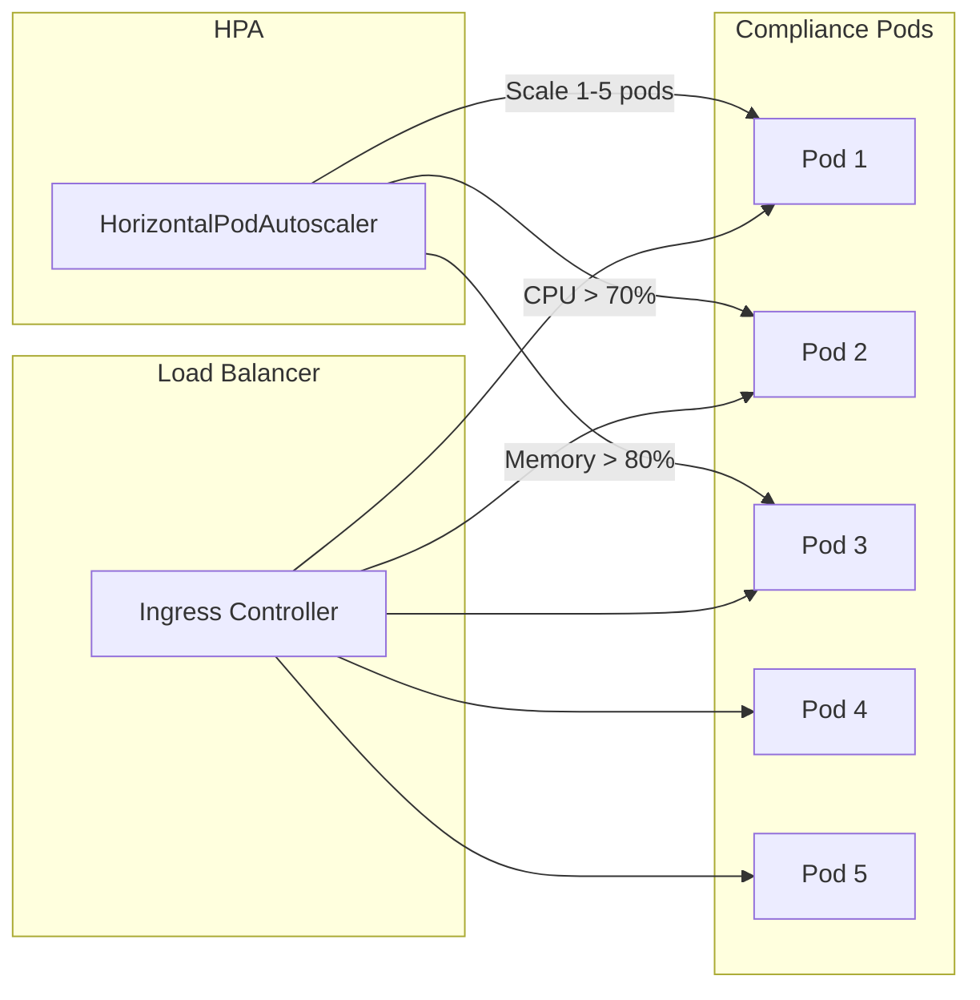
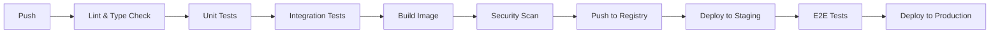

# Architecture

Technical deep-dive into Nexus Compliance Engine's design, components, and integration patterns.

---

## System Overview

Nexus Compliance Engine is a containerized microservice designed for AI-powered regulatory compliance assessment. It operates within the Nexus plugin ecosystem, leveraging shared infrastructure for authentication, data persistence, and AI capabilities.



---

## Component Architecture

### Core Components

| Component | Responsibility | Technology |
|-----------|---------------|------------|
| **REST API Layer** | Request handling, validation, routing | Express.js, OpenAPI |
| **Assessment Engine** | Compliance evaluation logic | TypeScript, Rule Engine |
| **AI Classification** | EU AI Act risk classification | Anthropic Claude API |
| **Report Generator** | PDF/HTML report creation | Puppeteer, Handlebars |
| **Control Library** | Framework controls and mappings | JSON/YAML, PostgreSQL |
| **Evidence Collector** | Automated evidence gathering | Integration adapters |

### Assessment Engine Detail



---

## API Layer

### Endpoint Structure

Base path: `/api/v1/compliance`

| Category | Endpoints | Description |
|----------|-----------|-------------|
| **Configuration** | `GET/PUT /config`, `PUT /config/master` | Tenant compliance settings |
| **Frameworks** | `GET /frameworks`, `GET /frameworks/:id/controls` | Framework and control data |
| **Assessments** | `POST/GET /assessments`, `POST /assessments/:id/run` | Assessment lifecycle |
| **AI Systems** | `CRUD /ai-systems`, `POST /ai-systems/:id/classify` | EU AI Act registry |
| **Reports** | `POST /reports/generate`, `GET /reports/:id/download` | Report generation |
| **Monitoring** | `GET /dashboard`, `GET /alerts`, `GET /audit-log` | Operational views |

### Request Flow



---

## Data Model

### Core Entities



### Database Tables

| Table | Purpose | Key Columns |
|-------|---------|-------------|
| `compliance_assessments` | Assessment records | id, tenant_id, framework_id, status, score |
| `compliance_findings` | Individual control findings | assessment_id, control_id, status, severity |
| `compliance_ai_systems` | EU AI Act registry | tenant_id, name, risk_level, classification |
| `compliance_reports` | Generated reports | assessment_id, type, format, storage_path |
| `compliance_alerts` | Active compliance alerts | tenant_id, type, severity, acknowledged |
| `compliance_audit_log` | All compliance actions | tenant_id, action, actor, timestamp |

---

## Security Model

### Permission Structure

The plugin operates under Nexus's permission system with the following grants:

```yaml
permissions:
  database:
    - "database:read:compliance_*"    # Read all compliance tables
    - "database:write:compliance_*"   # Write all compliance tables

  network:
    - "network:internal:nexus-graphrag"   # Knowledge retrieval
    - "network:internal:nexus-mageagent"  # Workflow automation

  filesystem:
    - "filesystem:read:/data/frameworks"  # Framework definitions
    - "filesystem:write:/data/reports"    # Generated reports
```

### Role-Based Access Control



### Data Protection

| Measure | Implementation |
|---------|----------------|
| **Encryption at Rest** | PostgreSQL TDE, AES-256 |
| **Encryption in Transit** | TLS 1.3 for all connections |
| **Data Isolation** | Tenant-level row security |
| **Audit Logging** | All actions logged with actor |
| **GDPR Compliance** | Data residency options (EU/US) |
| **Key Management** | Kubernetes secrets, HashiCorp Vault |

---

## AI Integration

### Anthropic Claude Integration

The AI classification service uses Claude for intelligent compliance analysis:



### AI-Powered Features

| Feature | AI Usage | Model |
|---------|----------|-------|
| **Risk Classification** | EU AI Act category determination | Claude Sonnet |
| **Control Guidance** | Context-aware implementation advice | Claude + GraphRAG |
| **Gap Analysis** | Intelligent gap prioritization | Claude Sonnet |
| **Report Narrative** | Executive summary generation | Claude Sonnet |

---

## Deployment Architecture

### Kubernetes Resources

```yaml
# Deployment configuration
apiVersion: apps/v1
kind: Deployment
metadata:
  name: nexus-compliance
  namespace: nexus
spec:
  replicas: 1
  strategy:
    type: RollingUpdate
    rollingUpdate:
      maxSurge: 1
      maxUnavailable: 0
```

### Resource Allocation

| Resource | Request | Limit |
|----------|---------|-------|
| **CPU** | 100m | 500m |
| **Memory** | 256Mi | 512Mi |
| **Disk** | 5Gi (reports) | 5Gi |

### Health Checks

| Endpoint | Purpose | Interval |
|----------|---------|----------|
| `/health` | Basic health | - |
| `/ready` | Readiness probe | 5s |
| `/live` | Liveness probe | 10s |

---

## Scaling Considerations

### Horizontal Scaling



### Scaling Metrics

| Metric | Threshold | Action |
|--------|-----------|--------|
| CPU Utilization | > 70% | Scale up |
| Memory Utilization | > 80% | Scale up |
| Request Latency | > 2s p99 | Scale up |
| Pod Count | Min: 1, Max: 5 | Auto-scale |

### Performance Optimization

- **Assessment Caching**: Results cached for 24 hours
- **Control Library**: In-memory cache with Redis fallback
- **Report Generation**: Async with webhook notification
- **Database**: Connection pooling (max 20 connections)

---

## Integration Points

### Nexus Service Dependencies

```mermaid
flowchart LR
    NCE[Nexus Compliance Engine]

    NCE -->|Knowledge queries| GR[GraphRAG]
    NCE -->|Workflow automation| MA[MageAgent]
    NCE -->|AI analysis| AN[Anthropic API]
    NCE -->|Data storage| PG[(PostgreSQL)]
    NCE -->|Report storage| FS[/data/reports]

    GR -->|Compliance knowledge| NCE
    MA -->|Remediation workflows| NCE
```

### External Integration Patterns

| Integration | Method | Use Case |
|-------------|--------|----------|
| **SIEM Systems** | Webhook | Incident ingestion for NIS2 |
| **GRC Platforms** | REST API | Bidirectional sync |
| **Ticketing Systems** | Webhook | Remediation tracking |
| **Identity Providers** | OIDC/SAML | SSO authentication |

---

## Monitoring & Observability

### Metrics Endpoint

Prometheus metrics available at `/metrics`:

```
# Assessment metrics
compliance_assessments_total{framework="gdpr",status="completed"}
compliance_assessment_duration_seconds{framework="ai_act"}
compliance_findings_total{severity="critical"}

# API metrics
http_requests_total{method="POST",path="/assessments"}
http_request_duration_seconds{method="GET",path="/dashboard"}

# AI metrics
ai_classification_requests_total
ai_classification_duration_seconds
```

### Logging

Structured JSON logs with correlation IDs:

```json
{
  "timestamp": "2025-01-15T10:30:00Z",
  "level": "info",
  "service": "nexus-compliance",
  "correlationId": "req-abc123",
  "tenantId": "tenant-xyz",
  "action": "assessment.completed",
  "framework": "gdpr",
  "score": 78,
  "duration_ms": 4523
}
```

---

## Disaster Recovery

### Backup Strategy

| Data Type | Frequency | Retention | Location |
|-----------|-----------|-----------|----------|
| PostgreSQL | Hourly | 30 days | S3/GCS |
| Reports | On generation | 1 year | S3/GCS |
| Framework Data | Daily | 90 days | Git |
| Audit Logs | Real-time | 7 years | S3/GCS |

### Recovery Objectives

| Metric | Target |
|--------|--------|
| **RPO** (Recovery Point Objective) | 1 hour |
| **RTO** (Recovery Time Objective) | 4 hours |
| **SLA** (Enterprise tier) | 99.9% uptime |

---

## Development & Testing

### Local Development

```bash
# Clone and setup
git clone https://github.com/adverant/nexus-compliance
cd nexus-compliance
npm install

# Run with local dependencies
docker-compose up -d postgres
npm run dev

# Run tests
npm run test
npm run test:integration
```

### CI/CD Pipeline



---

## Further Reading

- [API Reference](https://docs.adverant.ai/plugins/nexus-compliance/api) - Complete endpoint documentation
- [Framework Guides](https://docs.adverant.ai/plugins/nexus-compliance/frameworks) - Detailed framework information
- [Integration Guide](https://docs.adverant.ai/plugins/nexus-compliance/integrations) - Third-party integrations
- [Security Whitepaper](https://adverant.ai/security) - Security and compliance details
