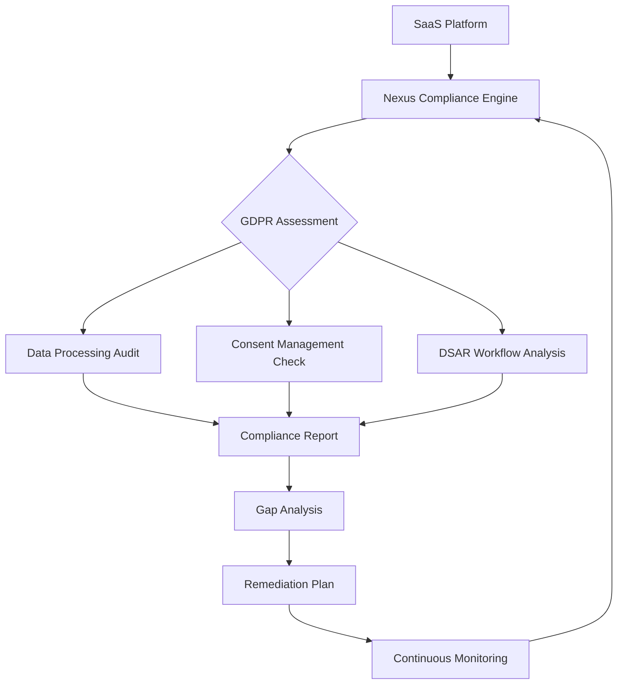
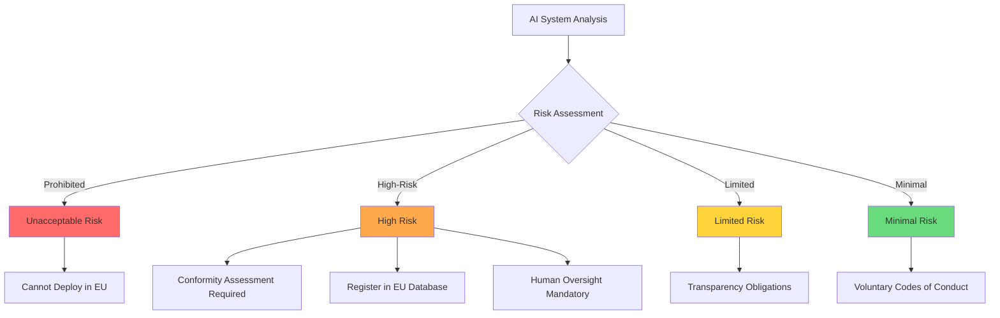
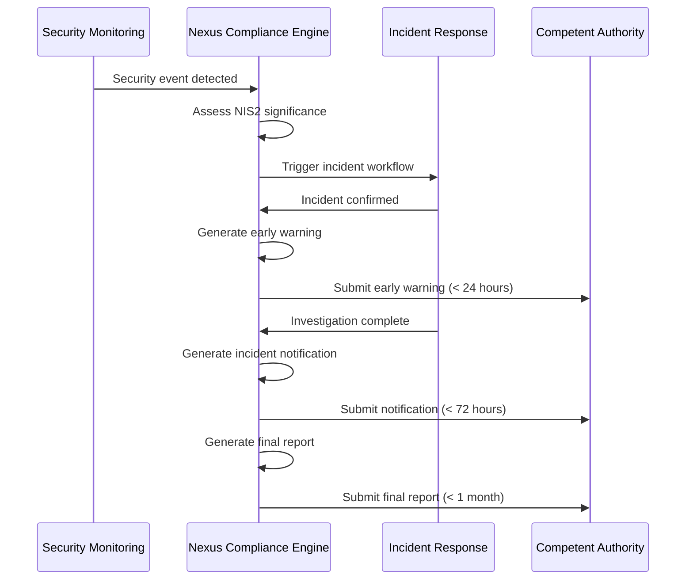
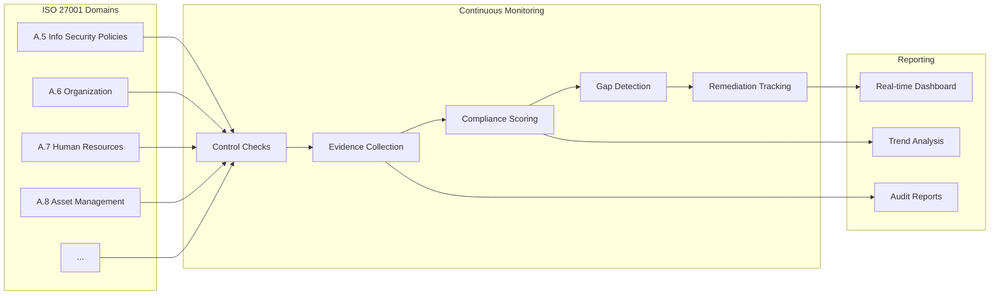
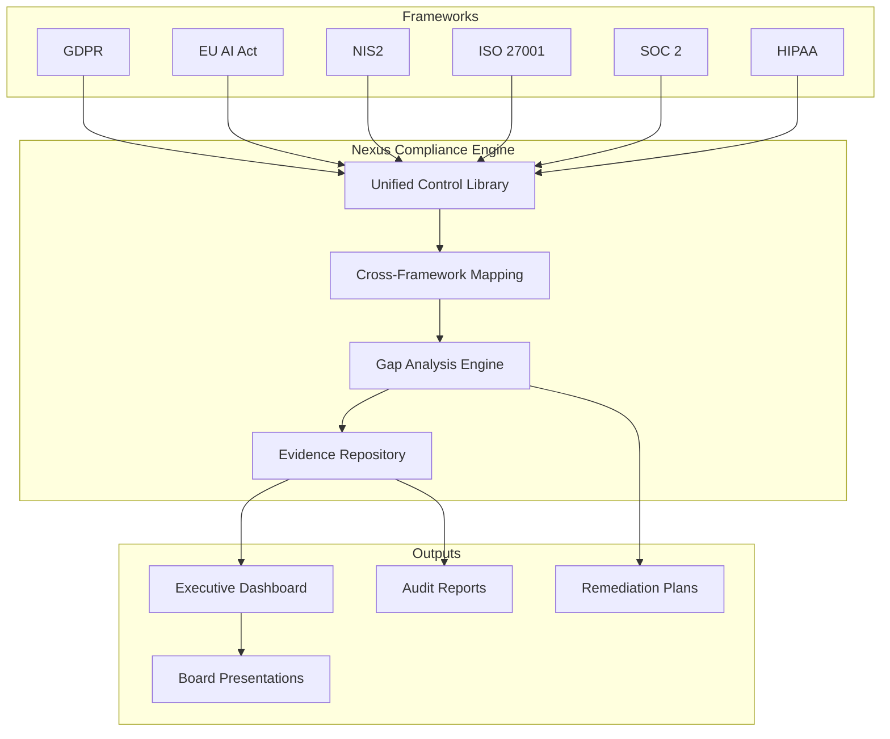

# Use Cases

Discover how organizations leverage Nexus Compliance Engine to navigate complex EU regulatory requirements efficiently.

---

## Use Case 1: GDPR Compliance for SaaS Platforms

### The Challenge

A B2B SaaS company processing customer data across multiple EU member states struggles to maintain GDPR compliance. Manual compliance tracking consumes 40+ hours monthly, and the risk of regulatory fines (up to 4% of annual revenue) creates constant anxiety for leadership.

### The Solution

Nexus Compliance Engine automates GDPR assessment across all data processing activities, identifying gaps before regulators do.

### Implementation

```typescript
import { NexusClient } from '@adverant/nexus-sdk';

const client = new NexusClient({ apiKey: process.env.NEXUS_API_KEY });
const compliance = client.plugin('nexus-compliance');

// Comprehensive GDPR assessment
const assessment = await compliance.assessCompliance({
  frameworkId: 'gdpr',
  targetSystemId: 'saas-platform-main',
  scope: [
    'data-processing-lawfulness',
    'consent-management',
    'data-subject-rights',
    'data-transfers',
    'security-measures',
    'breach-notification'
  ]
});

// Process data subject access request
const dsarResponse = await compliance.processDataSubjectRequest({
  requestType: 'access',
  subjectId: 'user_12345',
  requestDetails: 'Full data export requested by customer'
});

console.log(`DSAR Status: ${dsarResponse.status}`);
console.log(`Data Package: ${dsarResponse.dataPackageUrl}`);
```

### Workflow



### Results

- **Compliance time reduced**: 40 hours/month → 4 hours/month (90% reduction)
- **Gap identification**: Automated detection of 23 compliance gaps in first assessment
- **DSAR response time**: 30 days → 48 hours
- **Audit readiness**: Always prepared with up-to-date compliance documentation

---

## Use Case 2: EU AI Act Risk Classification

### The Challenge

A technology company deploying multiple AI systems needs to classify each system according to the EU AI Act's risk-based approach. Without proper classification, they face potential market access restrictions and fines up to €35 million.

### The Solution

Nexus Compliance Engine's AI classification tool analyzes system descriptions, use cases, and data categories to automatically determine EU AI Act risk levels and required compliance actions.

### Implementation

```typescript
// Register and classify AI systems
const aiSystems = [
  {
    name: 'Customer Chatbot',
    description: 'AI-powered customer service chatbot with NLP',
    useCases: ['customer-support', 'faq-responses'],
    dataCategories: ['customer-queries', 'interaction-logs']
  },
  {
    name: 'Resume Screener',
    description: 'AI system for initial resume filtering in recruitment',
    useCases: ['candidate-screening', 'resume-ranking'],
    dataCategories: ['resumes', 'job-applications', 'candidate-profiles']
  },
  {
    name: 'Fraud Detection',
    description: 'ML model detecting fraudulent transactions',
    useCases: ['fraud-prevention', 'transaction-monitoring'],
    dataCategories: ['transaction-data', 'user-behavior']
  }
];

for (const system of aiSystems) {
  const registered = await compliance.call('POST', '/ai-systems', system);

  const classification = await compliance.classifyAISystem({
    systemId: registered.systemId,
    systemDescription: system.description,
    useCases: system.useCases,
    dataCategories: system.dataCategories
  });

  console.log(`${system.name}: ${classification.riskCategory}`);
  console.log(`Required Actions: ${classification.requiredActions.join(', ')}`);
}
```

### AI Act Risk Categories



### Results

- **Classification time**: Days → Minutes per AI system
- **Risk identification**: Flagged resume screener as "high-risk" requiring conformity assessment
- **Compliance roadmap**: Automated generation of required actions per risk level
- **EU database registration**: Streamlined process for high-risk system registration

---

## Use Case 3: NIS2 Incident Reporting for Critical Infrastructure

### The Challenge

An energy company operating critical infrastructure must comply with NIS2 Directive requirements, including 24-hour incident reporting obligations. Manual processes risk missing tight deadlines and incurring penalties.

### The Solution

Nexus Compliance Engine integrates with security monitoring to detect incidents and automate NIS2-compliant reporting workflows.

### Implementation

```python
from nexus_sdk import NexusClient
import os

client = NexusClient(api_key=os.environ['NEXUS_API_KEY'])
compliance = client.plugin('nexus-compliance')

# NIS2 compliance assessment for critical infrastructure
assessment = compliance.assess_compliance(
    framework_id='nis2',
    target_system_id='energy-grid-scada',
    scope=[
        'risk-management',
        'incident-handling',
        'business-continuity',
        'supply-chain-security',
        'network-security',
        'access-control'
    ]
)

# Get NIS2-specific alerts
alerts = compliance.call('GET', '/alerts', {
    'framework': 'nis2',
    'severity': 'critical'
})

for alert in alerts['items']:
    print(f"Alert: {alert['title']}")
    print(f"Deadline: {alert['reportingDeadline']}")
    print(f"Authority: {alert['competentAuthority']}")
```

### NIS2 Incident Response Workflow



### Results

- **Reporting compliance**: 100% on-time incident notifications
- **Early warning**: Automated submission within 24-hour window
- **Audit trail**: Complete documentation for regulatory inquiries
- **Cross-border coordination**: Multi-jurisdiction notification support

---

## Use Case 4: ISO 27001 Continuous Compliance

### The Challenge

A financial services firm maintaining ISO 27001 certification spends significant resources on annual audits. Evidence collection is manual, and control effectiveness monitoring is reactive rather than proactive.

### The Solution

Nexus Compliance Engine provides continuous ISO 27001 control monitoring with automated evidence collection and real-time compliance scoring.

### Implementation

```typescript
// Continuous ISO 27001 monitoring
const dashboard = await compliance.call('GET', '/dashboard');

console.log(`Overall Compliance Score: ${dashboard.iso27001.score}%`);
console.log(`Controls Monitored: ${dashboard.iso27001.controlsMonitored}`);
console.log(`Last Assessment: ${dashboard.iso27001.lastAssessment}`);

// Get control-level details
const controls = await compliance.call('GET', '/frameworks/iso27001/controls');

for (const control of controls.items) {
  if (control.status !== 'compliant') {
    console.log(`Gap: ${control.id} - ${control.title}`);
    console.log(`Status: ${control.status}`);
    console.log(`Evidence Required: ${control.evidenceGaps.join(', ')}`);
  }
}

// Generate audit-ready report
const auditReport = await compliance.generateReport({
  assessmentId: dashboard.iso27001.latestAssessmentId,
  reportType: 'full_audit',
  format: 'pdf',
  includeEvidence: true
});

console.log(`Audit Report: ${auditReport.downloadUrl}`);
```

### ISO 27001 Control Monitoring



### Results

- **Audit preparation**: 3 weeks → 2 days
- **Evidence collection**: 80% automated
- **Control coverage**: 114 controls continuously monitored
- **Certification maintenance**: Reduced recertification effort by 60%

---

## Use Case 5: Multi-Framework Compliance Dashboard

### The Challenge

A multinational enterprise must comply with multiple frameworks simultaneously: GDPR for data protection, EU AI Act for AI systems, NIS2 for critical operations, and ISO 27001 for information security. Managing these separately creates silos and inefficiencies.

### The Solution

Nexus Compliance Engine provides unified multi-framework compliance management with integrated dashboards and cross-framework gap analysis.

### Implementation

```typescript
// Unified compliance dashboard
const dashboard = await compliance.call('GET', '/dashboard');

console.log('=== Enterprise Compliance Status ===');
console.log(`GDPR: ${dashboard.gdpr.score}% (${dashboard.gdpr.status})`);
console.log(`AI Act: ${dashboard.aiAct.score}% (${dashboard.aiAct.status})`);
console.log(`NIS2: ${dashboard.nis2.score}% (${dashboard.nis2.status})`);
console.log(`ISO 27001: ${dashboard.iso27001.score}% (${dashboard.iso27001.status})`);

// Cross-framework control mapping
const mapping = await compliance.call('GET', '/frameworks/control-mapping', {
  frameworks: ['gdpr', 'iso27001', 'nis2']
});

console.log('\n=== Shared Controls ===');
for (const shared of mapping.sharedControls) {
  console.log(`${shared.topic}: Addresses ${shared.frameworks.join(', ')}`);
}

// Generate board-ready presentation
const boardReport = await compliance.generateReport({
  assessmentId: 'latest',
  reportType: 'board_presentation',
  format: 'pdf',
  includeEvidence: false
});
```

### Unified Compliance Architecture



### Results

- **Framework coverage**: 6 frameworks from single platform
- **Control efficiency**: 40% of controls satisfy multiple frameworks
- **Reporting consolidation**: Single dashboard for all compliance metrics
- **Board visibility**: Executive-level compliance reporting in minutes

---

## Integration Scenarios

### Integration with Nexus GraphRAG

Leverage GraphRAG for intelligent compliance knowledge retrieval:

```typescript
// Query compliance knowledge base
const guidance = await compliance.getControlGuidance({
  controlId: 'GDPR-Art.17',
  context: 'B2B SaaS platform with customer data in PostgreSQL'
});

console.log(`Implementation Steps: ${guidance.implementationSteps}`);
console.log(`Best Practices: ${guidance.bestPractices}`);
console.log(`Common Pitfalls: ${guidance.commonPitfalls}`);
```

### Integration with Nexus MageAgent

Automate compliance workflows with AI agents:

```typescript
// Automated compliance remediation
const workflow = await mageagent.createWorkflow({
  trigger: 'compliance-gap-detected',
  actions: [
    { type: 'create-jira-ticket', template: 'compliance-remediation' },
    { type: 'notify-slack', channel: '#compliance-team' },
    { type: 'schedule-review', assignee: 'compliance-officer' }
  ]
});
```

---

## Ready to Transform Your Compliance Program?

Start with a free compliance assessment to identify your regulatory gaps.

**[Start Free Assessment](https://app.adverant.ai/plugins/nexus-compliance)** | **[View Pricing](https://adverant.ai/pricing)** | **[Contact Sales](https://adverant.ai/contact)**
